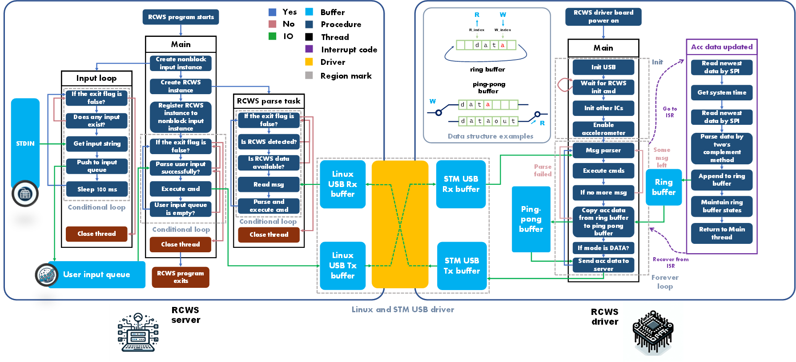
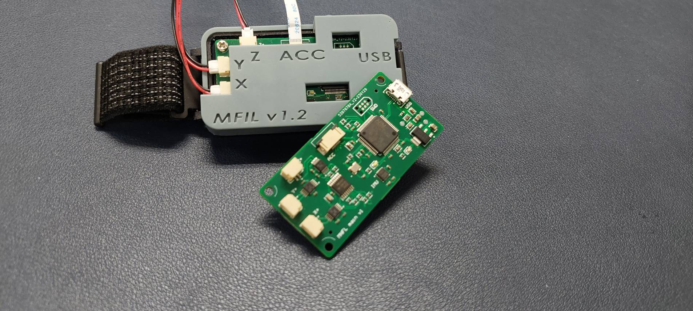
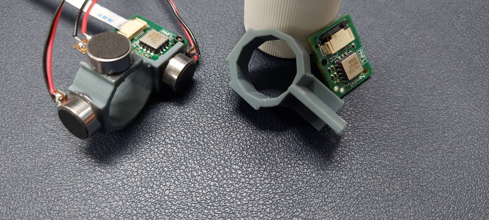
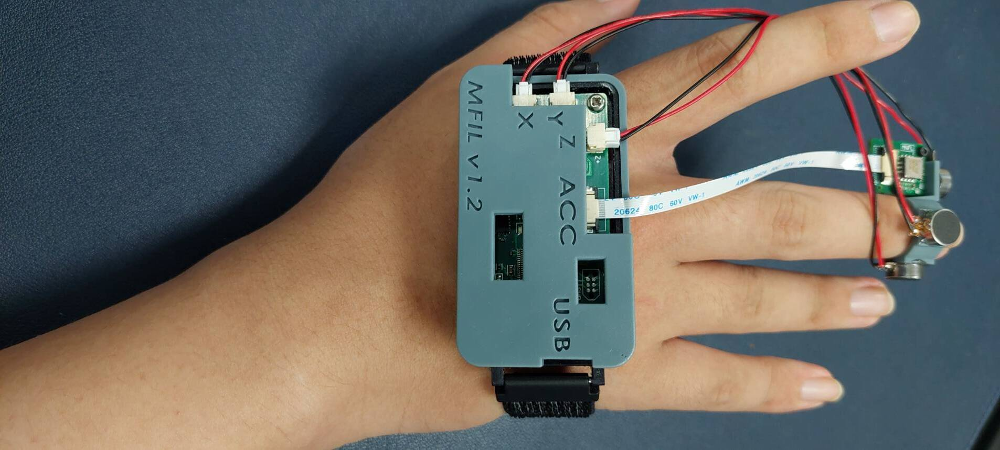
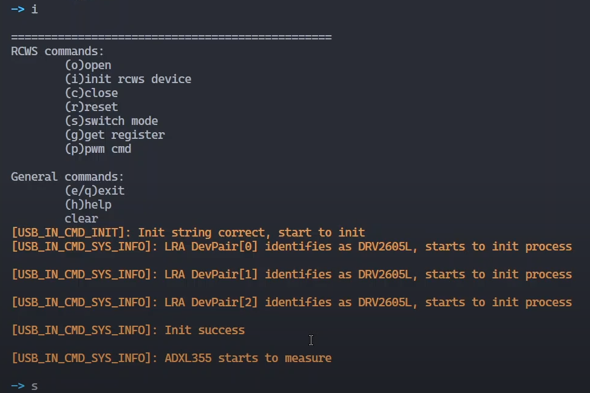

# RCWS

This repository serves as the home directory for repositories related to RCWS.

## What is RCWS?

RCWS (Remote Control Wearable System) is a haptic feedback module developed in-house by the MFIL at NTHU. At its core, the module is driven by an STM32 F412RxT6 microcontroller. After flashing the [rcws_stm32_firmware](https://github.com/Dennis40816/rcws_stm32_firmware) into the MCU, the module uses PWM control through the DRV2605Ls to drive LRAs (Linear Resonant Actuator) VG1040003D, thereby generating vibratory feedback for the user. Moreover, the module integrates an ADXL355 accelerometer to quantitatively assess the vibratory effects.

Users can interact with the RCWS module through a host-side application written in C++, which communicates with the module via USB (CDC) to exchange specific commands.

The initial design concept was conceived for noisy industrial environments where conveying the vibrations of machinery through a ring could effectively alert users using a haptic channel—an unconventional medium for information reception—thereby reducing the likelihood of missed alerts. In addition, the module holds potential for a variety of applications, such as serving as a multi-axis remote control feedback device, a gaming haptic feedback system, and a tool for remote emotional communication.

The diagram below illustrates the conceptual software architecture of the RCWS system:

**[Watch on YouTube](https://www.youtube.com/watch?v=6R-wFlldGjk)**

## Appearance

### RCWS Module

  
  

### RCWS CLI

## Repositories

The RCWS module’s firmware, **rcws_stm32_firmware**, operates in conjunction with the PC-side **rcws_host** application to facilitate user interactions. The **rcws_host** program converts user inputs into RCWS messages, which are transmitted via USB to the RCWS module. The firmware then parses these messages and executes the corresponding commands.

| Repository                                                                | Description                                                                  |
| ------------------------------------------------------------------------- | ---------------------------------------------------------------------------- |
| [rcws_host](https://github.com/Dennis40816/rcws_host)                     | RCWS host-side documentation based on Linux (including WSL).                 |
| [rcws_stm32_firmware](https://github.com/Dennis40816/rcws_stm32_firmware) | RCWS firmware documentation based on STM32 HAL.                              |
| [rcws_pcb](https://github.com/Dennis40816/rcws_pcb)                       | RCWS PCB documentation, including Gerber files sent to the PCB manufacturer. |
| [rcws_mechanism](https://github.com/Dennis40816/rcws_mechanism)           | RCWS mechanism documentation, including STL files for 3D printing.           |

## Accomplishments

### Papers

- [Linear Resonator Actuator-Constructed Wearable Haptic System with the Application of Converting Remote Grinding Force to Vibratory Sensation](https://doi.org/10.3390/act12090359)
- [Study on the combination of virtual machine tools and wearable vibration devices for operators experiencing cutting forces in the milling process](https://doi.org/10.1038/s41598-024-59208-y)

### Honor

- Selected as a **Finalist** for the 12th National Collegiate AI Intelligent Automation Equipment Creation Award by GPM Corp.
